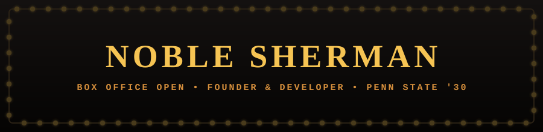
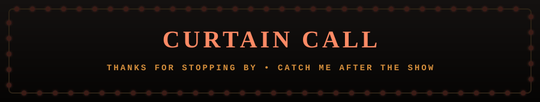

<div align="center">



<br/>


<br/><br/>

<i><a href="https://boxfiveticketing.com/">Box Five Ticketing</a> · <a href="https://nobleswebdesign.com/">Nobles Web Design</a> · <a href="https://www.linkedin.com/in/noblesherman/">LinkedIn</a> · Penn State, College of IST '30</i>

</div>

<br/>


<br/>

I'm a student at **Penn State University**, studying Enterprise Technology Integration in the College of Information Sciences and Technology. Outside of class, I build software for real organizations, real users, and real problems — mostly ones involving a box office.

I founded and run **Box Five Ticketing**, a commercial ticketing and box office platform built for schools, theaters, and live event organizations. That work spans full-stack web, mobile apps, payment infrastructure, digital ticketing, automation, and the occasional piece of hardware that has no business being as finicky as it is.

A good chunk of what I build lives in private repos, since it backs real commercial products and client systems — so consider this profile the lobby, not the whole theater.

<div align="center">

```
 ┌─────────────────────────────────────┐
  ·  ADMIT ONE          NO. 000005     ·
 │                                     │
  ·  NOBLE SHERMAN                     ·
 │  FOUNDER · DEVELOPER · TECHNICIAN   │
  ·  SEAT: BOX FIVE                    ·
 │                                     │
  ·  "your whole box office, built     ·
 │      for community theatre"        │
 └─────────────────────────────────────┘
```

</div>

<br/>


<br/>

<table>
<tr>
<td width="34%" valign="top">

**🎟️ Box Five Ticketing**

The main production. A full box-office platform for theaters and live event organizations:

- Online sales + reserved seating
- Box office ops + mobile scanning
- Stripe payments & Stripe Connect
- Tap to Pay on iPhone
- Apple & Google Wallet tickets
- Donations, reporting, analytics


*Production source is private.*

</td>
<td width="33%" valign="top">

**🎭 Theater Technology**

The backstage work — software and systems that keep a live show running:

- Ticketing platforms + seat maps
- Admin dashboards
- Payment workflows
- Production websites
- Digital ticket systems

Plus hands-on time with theatrical lighting and live event tech.

</td>
<td width="33%" valign="top">

**🌐 Nobles Web Designs**

The side stage — a freelance shop building sites for small businesses and nonprofits:

- Custom sites, design through launch
- Local businesses & nonprofit clients
- Moving the stack toward Next.js + Supabase

[nobleswebdesign.com →](https://nobleswebdesign.com/)

</td>
</tr>
</table>

<br/>


<br/>

<table>
<tr><td><b>Front of House</b><br/><sub>frontend</sub></td><td></td></tr>
<tr><td><b>Back of House</b><br/><sub>backend</sub></td><td></td></tr>
<tr><td><b>Touring Company</b><br/><sub>mobile</sub></td><td> React Native · Expo · iOS · Android</td></tr>
<tr><td><b>Stage Management</b><br/><sub>tooling</sub></td><td></td></tr>
<tr><td><b>Script</b><br/><sub>languages</sub></td><td></td></tr>
</table>

<br/>


<br/>

| Show | Genre | Synopsis |
|---|---|---|
| **🎟️ Box Five Ticketing** | React · React Native · Node · PostgreSQL · Prisma · Stripe | Commercial ticketing and box-office software for schools and community theaters. Private production repo. |
| **📢 Rose Tree Announcer** | Python · Raspberry Pi · GPIO | A Raspberry Pi based automated announcement system built for the Rose Tree Park Summer Festival. |
| **🎭 Penncrest Theater** | React · TypeScript · PostgreSQL · Payments | Full-stack ticketing and digital-ops platform for a live theater program, seat maps included. |

<br/>


<br/>

Not everything I do compiles. My hands-on experience also covers:

<table>
<tr>
<td width="50%" valign="top">

- ETC theatrical lighting systems
- DMX lighting networks
- Raspberry Pi hardware

</td>
<td width="50%" valign="top">

- Kiosk systems
- Live production environments
- Technical troubleshooting & event operations

</td>
</tr>
</table>

I like building software — but I like it more once it's survived contact with an actual audience, an actual house manager, and an actual Wi-Fi router held together with gaff tape.

<br/>


<br/>

**Now playing:**
- 🎓 Studying Enterprise Technology Integration at Penn State
- 🚀 Building Box Five Ticketing
- 💻 Sharpening skills across software engineering, IT, product, data, and technical consulting
- 🔎 House lights up for **Summer 2027** technology internships

<br/>


<br/>

| | |
|---|---|
| **LinkedIn** | [linkedin.com/in/noblesherman](https://www.linkedin.com/in/noblesherman/) |
| **Box Five Ticketing** | [boxfiveticketing.com](https://boxfiveticketing.com/) |
| **Nobles Web Design** | [nobleswebdesign.com](https://nobleswebdesign.com/) |

<br/>

<div align="center">



<sub>Penn State University · College of Information Sciences and Technology · Class of 2030</sub>

</div>
